# GuitarToolkit

[](https://github.com/LuTiK1984/GuitarToolkit/actions/workflows/ci.yml)


[Русская версия](#guitartoolkit-ru)

**GuitarToolkit** is an open-source Windows guitar toolkit for practice, writing, and DAW work. It ships as both a standalone WPF desktop app and a VST3 plugin, with the same musician-focused interface shared between both targets.

The app brings together a tuner, metronome, chord library, scale fretboard, interval trainer, progression builder, circle of fifths, and Guitar Pro / MusicXML tab viewer. The goal is practical: one compact place for daily guitar work, quick theory checks, and sketching ideas inside or outside a DAW.

## Project Status

GuitarToolkit is an active open-source passion project.

| Target | Status |
| --- | --- |
| Desktop app | Usable on Windows 10/11 x64 |
| VST3 plugin | Usable, with DAW compatibility still being collected |
| Tabs viewer | Active development; alphaTab import limits may apply |
| Platform | Windows-only for now |

## Quick Start

For a more detailed installation walkthrough, see the [Quick Start guide](docs/user/QUICK_START.md).

1. Download the latest build from [GitHub Releases](https://github.com/LuTiK1984/GuitarToolkit/releases).
2. For Desktop: unzip `GuitarToolkit_DESKTOP_v.<version>.zip` and run the desktop executable.
3. For VST3: unzip `GuitarToolkit_VST3_v.<version>.zip` and copy the whole `GuitarToolkit` plugin folder to:

```text
C:\Program Files\Common Files\VST3\GuitarToolkit\
```

4. Rescan plugins in your DAW.
5. If something fails, check logs in:

```text
%AppData%\GuitarToolkit\logs
```

## Downloads

Get the latest build from [GitHub Releases](https://github.com/LuTiK1984/GuitarToolkit/releases).

- `GuitarToolkit_DESKTOP_v.1.5.0.zip` - standalone Windows desktop app.
- `GuitarToolkit_VST3_v.1.5.0.zip` - VST3 plugin package for DAW hosts.

## Screenshots

### Dark Theme

| Tuner | Metronome |
| --- | --- |
| 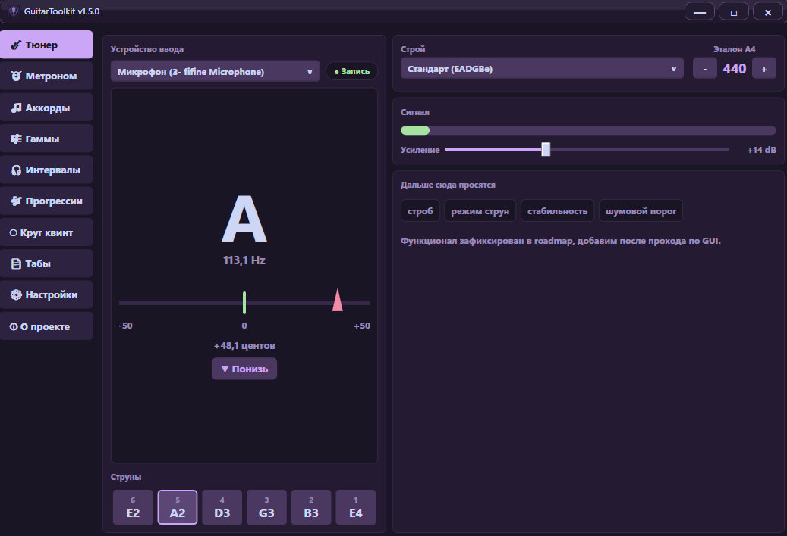 | 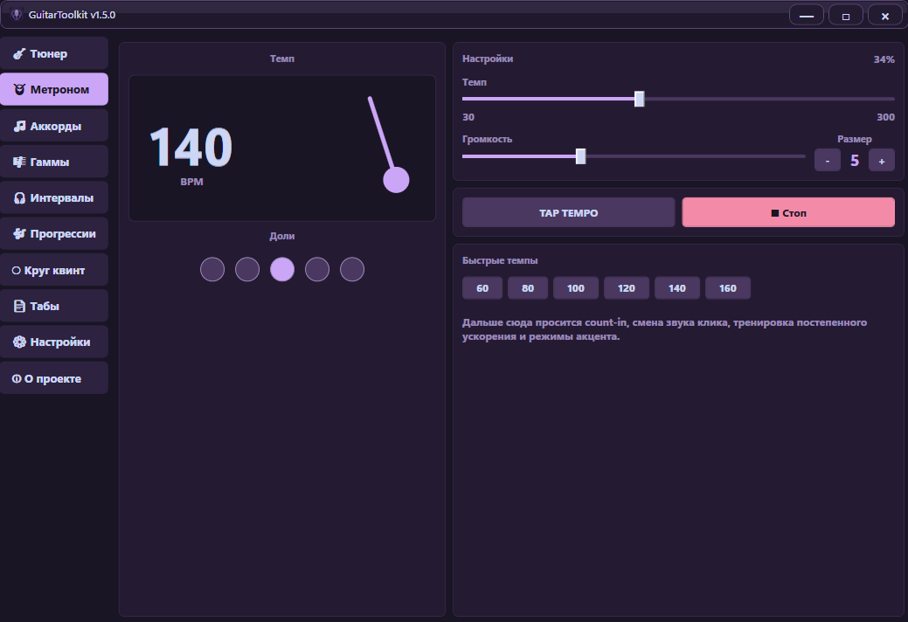 |

| Chords | Scales and Fretboard |
| --- | --- |
| 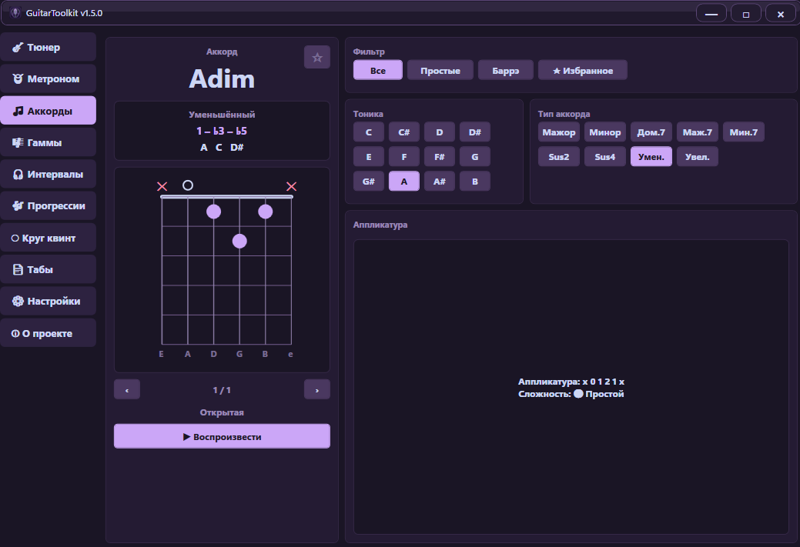 | 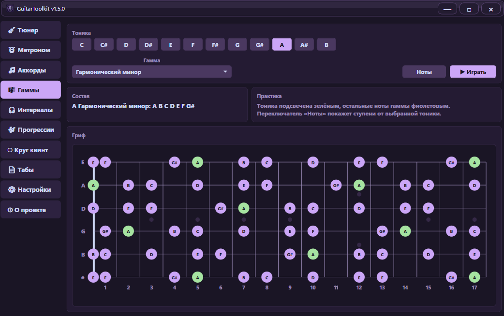 |

| Intervals | Progressions |
| --- | --- |
| 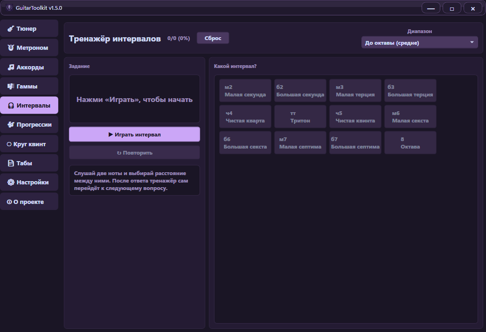 | 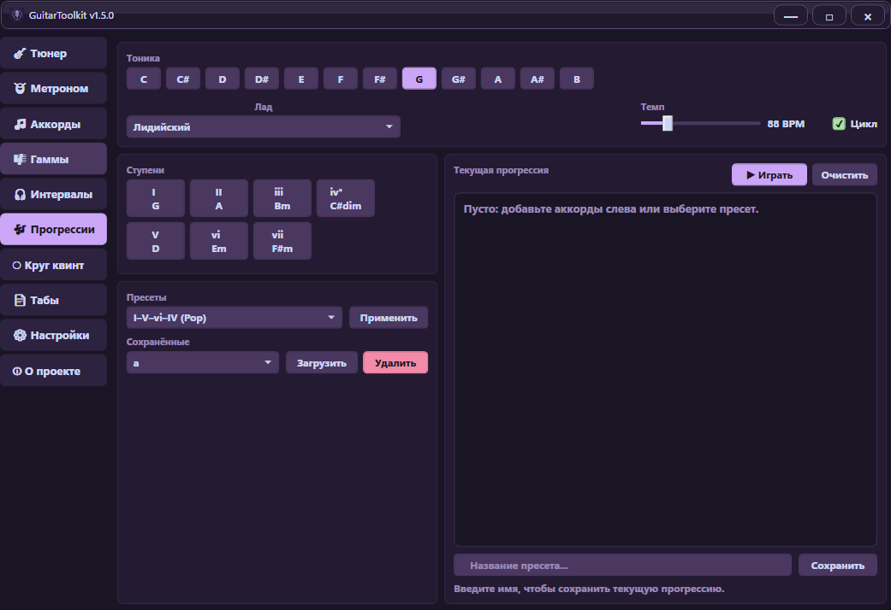 |

| Circle of Fifths | Tabs |
| --- | --- |
| 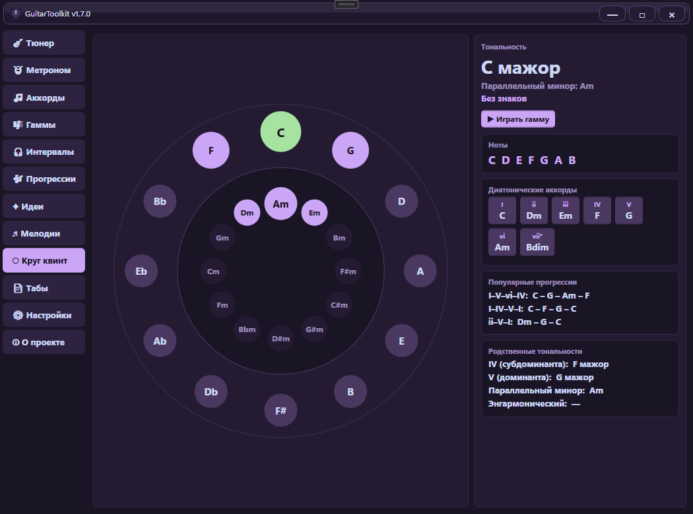 | 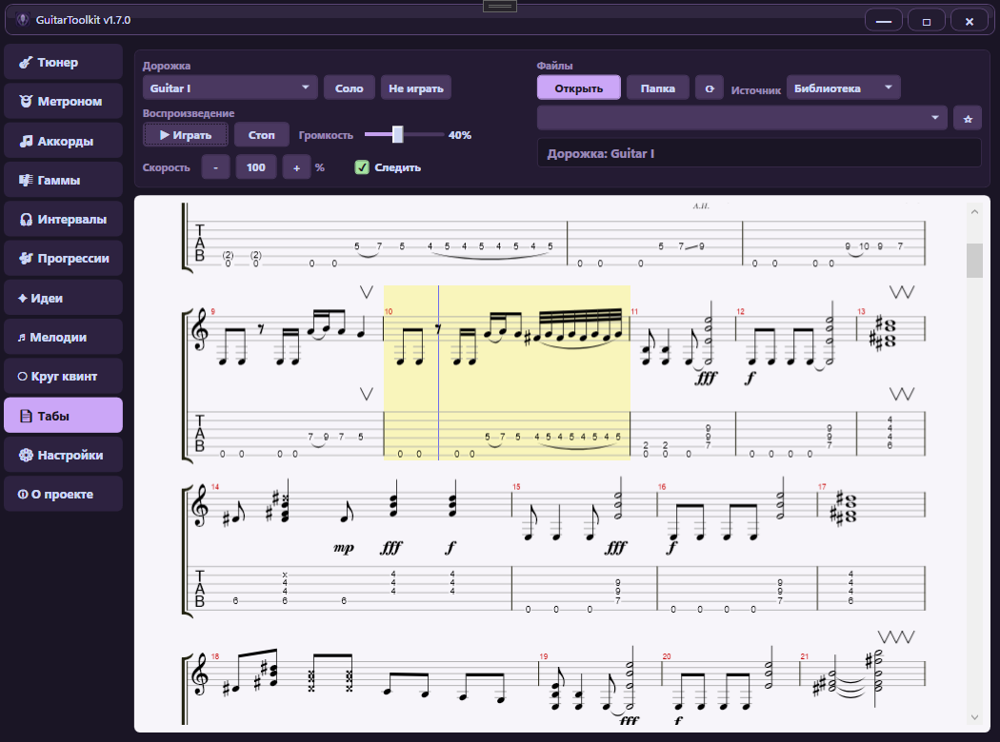 |

| Settings |
| --- |
| 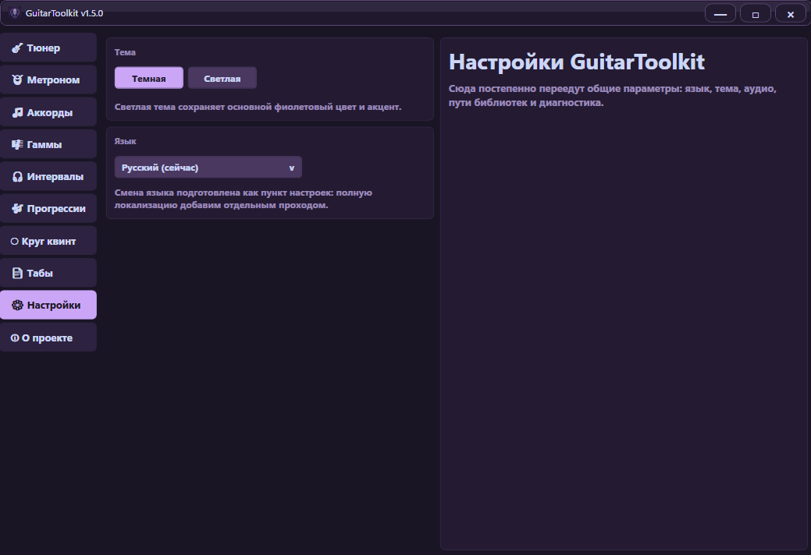 |

### Light Theme

| Tuner | Scales and Fretboard | Tabs |
| --- | --- | --- |
| 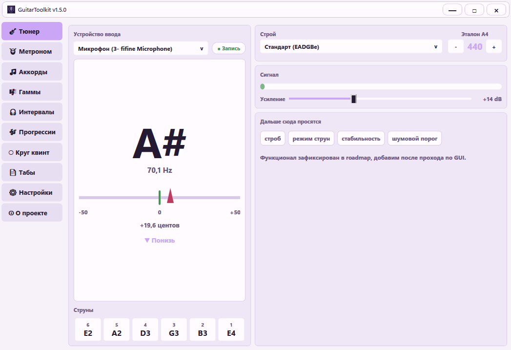 | 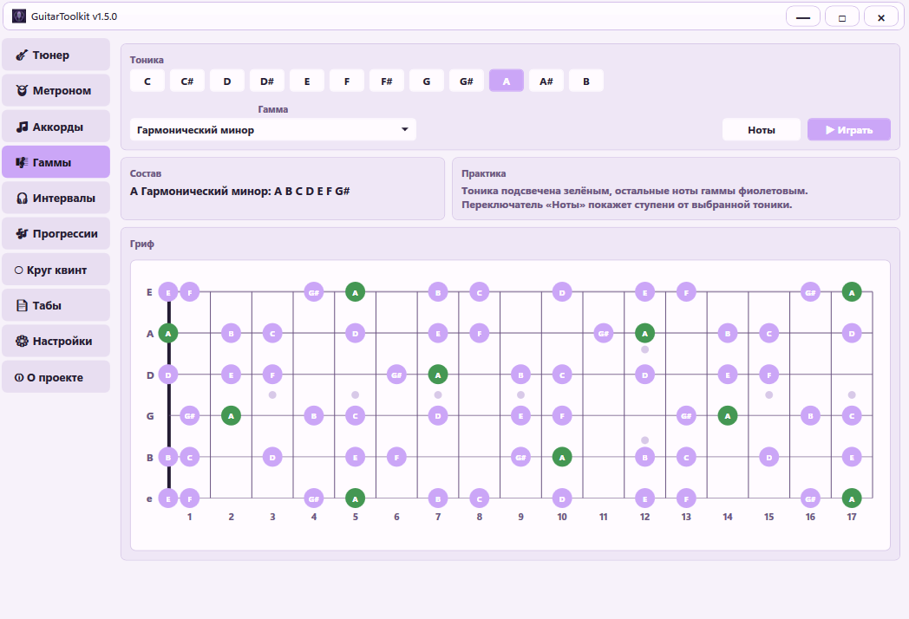 | 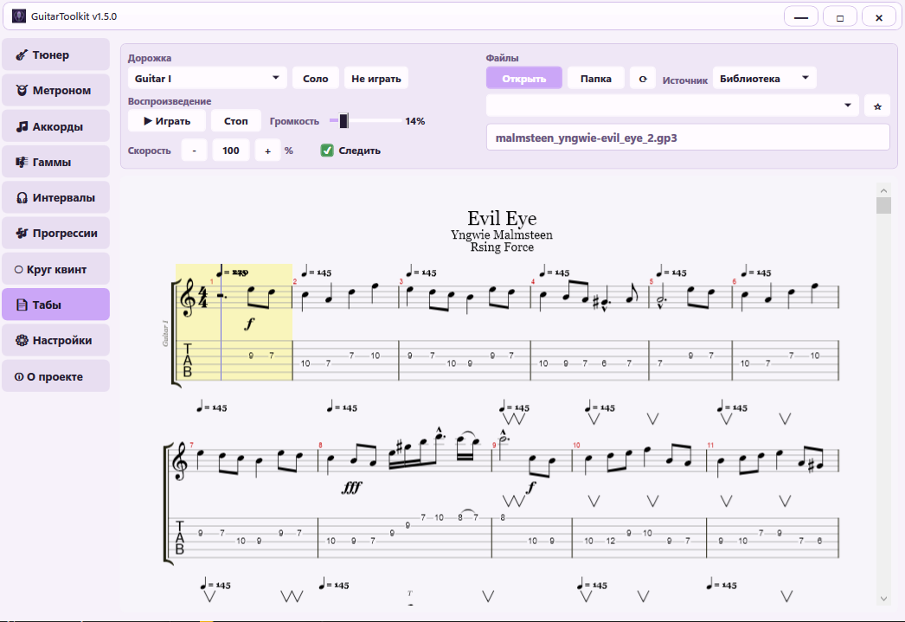 |

## What It Can Do

### Tuner

- Real-time pitch detection for guitar.
- FFT, Harmonic Product Spectrum, and parabolic interpolation.
- Detected note, frequency, cents offset, tuning direction, and signal level.
- Selectable input device in the desktop app.
- Standard and alternate tunings: Standard, Drop D, Drop C, Open G, Open D, DADGAD, Half Step Down, Full Step Down.
- Adjustable A4 reference from 420 to 460 Hz.
- Input gain control from 0 to 40 dB.

### Metronome

- Tempo from 30 to 300 BPM.
- 2 to 8 beats per measure.
- Tap tempo, quick tempo buttons, beat indicators, and visual pendulum.
- Spacebar start/stop from any tab.
- Sample-generated click output for the desktop app and plugin target.

### Chords

- 12 roots and common chord types: major, minor, 7, maj7, m7, sus2, sus4, dim, aug.
- Multiple voicings per chord.
- Diagram with muted strings, open strings, and barre support.
- Formula, exact notes, difficulty, and favorites.
- Synthesized chord playback.

### Scales and Fretboard

- Compact fretboard with string labels, fret numbers, fret markers, and highlighted tonic.
- Major, natural minor, pentatonic, blues, modes, harmonic minor, melodic minor, and chromatic scales.
- Note-name and degree display modes.
- Ascending scale playback.

### Interval Trainer

- Plays two notes and asks the user to identify the interval.
- Intervals from unison to octave.
- Difficulty ranges, answer feedback, statistics, repeat, and auto-advance.

### Progression Builder

- Diatonic chords for 12 roots and multiple modes/scales.
- Click-to-build workflow for current progressions.
- Built-in progression presets.
- Saved custom presets with explicit save, load, and delete actions.
- Tempo-based playback with optional looping.

### Circle of Fifths

- Interactive major/minor circle of fifths.
- Key signature, scale notes, diatonic chords, common progressions, related keys, and enharmonic equivalents.
- Selected scale playback.

### Tabs

- Guitar Pro and MusicXML rendering through alphaTab.
- Target formats include GP3, GP4, GP5/GPX, and MusicXML when alphaTab can import the file.
- Track selection, notation, tablature, play/pause, stop, speed, volume, selected-track solo/mute, and auto-follow.
- Recent files, favorites, and a simple library folder.
- Failed alphaTab imports are quarantined from the current library list so one bad file does not keep breaking the Tabs page.

## Architecture

```text
GuitarToolkit.sln
|-- GuitarToolkit.Core      DSP, theory models, engines, settings
|-- GuitarToolkit.UI        Shared WPF controls used by Desktop and VST3
|-- GuitarToolkit.Desktop   Standalone WPF app via NAudio
|-- GuitarToolkit.Plugin    VST3 entry point via AudioPlugSharp
`-- GuitarToolkit.Tests     xUnit tests for Core behavior
```

`GuitarToolkit.Core` intentionally stays independent from WPF, NAudio, and AudioPlugSharp. Desktop and VST3 integration live in separate projects, while the shared WPF UI is reused by both targets.

## Technology Stack

| Area | Technology |
| --- | --- |
| Language | C# |
| Runtime | .NET 8 |
| UI | WPF |
| Desktop audio | NAudio 2.2.1 |
| Plugin | VST3 via AudioPlugSharp 0.7.9 |
| Tabs | alphaTab / AlphaSkia |
| Tests | xUnit |
| License | MIT |

## Requirements

- Windows 10/11 x64.
- .NET 8 runtime for running builds, or .NET 8 SDK for development.
- Visual Studio 2022 for development.
- For VST3: a DAW with VST3 support, such as FL Studio, Reaper, Cubase, Ableton Live, or another compatible host.

## Build from Source

Open `GuitarToolkit.sln` in Visual Studio 2022 and select `x64`.

Command line:

```powershell
dotnet restore GuitarToolkit.sln
dotnet build GuitarToolkit.sln --configuration Debug
dotnet test GuitarToolkit.sln --configuration Debug
```

Release package build:

```powershell
powershell -ExecutionPolicy Bypass -File .\build-release.ps1 -Version 1.5.0 -Configuration Release
```

Current verification status:

- Build: 0 errors, 0 warnings.
- Tests: 73/73 passing.

## VST3 Deployment

Use the release ZIP or build the plugin project in `x64`, then run:

```powershell
deploy-vst.bat
```

The script copies the full plugin output folder to:

```text
C:\Program Files\Common Files\VST3\GuitarToolkit\
```

Copy the whole `GuitarToolkit` plugin folder, not only `GuitarToolkit.PluginBridge.vst3`. The plugin needs its DLL dependencies and the `runtimes` folder, especially for the tab viewer.

DAW notes:

- [FL Studio setup](docs/user/FL_STUDIO.md)
- [Reaper setup](docs/user/REAPER.md)
- [Supported DAWs](docs/user/SUPPORTED_DAWS.md)

The repository intentionally includes several NuGet-sourced VST bridge/runtime files used for deployment and DAW loading:

- `GuitarToolkit.PluginBridge.vst3`
- `GuitarToolkit.PluginBridge.runtimeconfig.json`
- `AudioPlugSharpWPF.dll`
- `Ijwhost.dll`

## Data and Logs

User data is stored in:

```text
%AppData%\GuitarToolkit\
```

Files:

- `settings.json` - general settings.
- `favorites.json` - favorite chords.
- `custom_presets.json` - custom progression presets.

Diagnostic logs are written to:

```text
%AppData%\GuitarToolkit\logs
```

## Community and Support

- [Downloads / Releases](https://github.com/LuTiK1984/GuitarToolkit/releases) - download Desktop and VST3 builds.
- [Quick Start](docs/user/QUICK_START.md) - install and launch GuitarToolkit.
- [Documentation](docs/README.md) - full documentation index.
- [Discussions](https://github.com/LuTiK1984/GuitarToolkit/discussions) - questions, ideas, DAW compatibility reports, and feedback.
- [Support](docs/user/SUPPORT.md) - where to ask for help and what details to include.
- [Contributing](CONTRIBUTING.md) - how to contribute.
- [Security](SECURITY.md) - how to report sensitive issues.

Use Discussions for questions and ideas. Use Issues for reproducible bugs and scoped development tasks.

## License

GuitarToolkit is released under the [MIT License](LICENSE).

VST is a trademark of Steinberg Media Technologies GmbH. Third-party dependency notes are listed in [THIRD_PARTY_NOTICES.md](THIRD_PARTY_NOTICES.md).

---

<a id="guitartoolkit-ru"></a>

# GuitarToolkit RU

[English version](#guitartoolkit)

**GuitarToolkit** - open-source набор инструментов для гитаристов под Windows, практики, набросков и работы в DAW. Проект поставляется как standalone WPF-приложение и как VST3-плагин, а общий интерфейс используется в обеих версиях.

В одном компактном приложении собраны тюнер, метроном, справочник аккордов, гриф с гаммами, тренажёр интервалов, построитель прогрессий, круг квинт и просмотр табулатур Guitar Pro / MusicXML. Идея проекта простая: дать гитаристу практичный рабочий набор для ежедневных занятий, быстрой проверки теории и музыкальных идей внутри DAW или отдельно от неё.

## Статус проекта

GuitarToolkit — активный open-source passion project.

| Цель | Статус |
| --- | --- |
| Desktop-приложение | Можно использовать на Windows 10/11 x64 |
| VST3-плагин | Можно использовать, совместимость с DAW ещё собирается |
| Просмотр табов | Активная разработка; возможны ограничения импорта alphaTab |
| Платформа | Пока только Windows |

## Быстрый старт

Подробная инструкция по установке находится в [Quick Start guide](docs/user/QUICK_START.md).

1. Скачайте последнюю сборку на странице [GitHub Releases](https://github.com/LuTiK1984/GuitarToolkit/releases).
2. Для Desktop: распакуйте `GuitarToolkit_DESKTOP_v.<version>.zip` и запустите desktop executable.
3. Для VST3: распакуйте `GuitarToolkit_VST3_v.<version>.zip` и скопируйте всю папку плагина `GuitarToolkit` сюда:

```text
C:\Program Files\Common Files\VST3\GuitarToolkit\
```

4. Пересканируйте плагины в DAW.
5. Если что-то не работает, проверьте логи:

```text
%AppData%\GuitarToolkit\logs
```

## Загрузка

Актуальная версия доступна на странице [GitHub Releases](https://github.com/LuTiK1984/GuitarToolkit/releases).

- `GuitarToolkit_DESKTOP_v.1.5.0.zip` - standalone-приложение для Windows.
- `GuitarToolkit_VST3_v.1.5.0.zip` - пакет VST3-плагина для DAW.

## Скриншоты

### Тёмная тема

| Тюнер | Метроном |
| --- | --- |
|  |  |

| Аккорды | Гаммы и гриф |
| --- | --- |
|  |  |

| Интервалы | Прогрессии |
| --- | --- |
|  |  |

| Круг квинт | Табы |
| --- | --- |
|  |  |

| Настройки |
| --- |
|  |

### Светлая тема

| Тюнер | Гаммы и гриф | Табы |
| --- | --- | --- |
|  |  |  |

## Возможности

### Тюнер

- Определение высоты звука гитары в реальном времени.
- FFT, Harmonic Product Spectrum и параболическая интерполяция.
- Нота, частота, отклонение в центах, направление настройки и уровень сигнала.
- Выбор входного устройства в desktop-версии.
- Строи: Standard, Drop D, Drop C, Open G, Open D, DADGAD, Half Step Down, Full Step Down.
- Эталон A4 от 420 до 460 Гц.
- Усиление входа от 0 до 40 дБ.

### Метроном

- Темп от 30 до 300 BPM.
- Размер от 2 до 8 долей.
- Tap tempo, быстрые кнопки темпа, индикаторы долей и визуальный маятник.
- Запуск и остановка по пробелу из любой вкладки.
- Генерация клика для desktop-приложения и VST3-плагина.

### Аккорды

- 12 тоник и основные типы аккордов: major, minor, 7, maj7, m7, sus2, sus4, dim, aug.
- Несколько аппликатур для одного аккорда.
- Диаграмма с открытыми струнами, заглушёнными струнами и баррэ.
- Формула, точные ноты, сложность и избранное.
- Воспроизведение аккорда синтезом.

### Гаммы и гриф

- Компактный гитарный гриф с подписями струн, номерами ладов, маркерами и подсветкой тоники.
- Мажор, натуральный минор, пентатоника, блюзовая гамма, лады, гармонический минор, мелодический минор и хроматика.
- Режимы отображения нот или ступеней.
- Восходящее воспроизведение выбранной гаммы.

### Тренажёр интервалов

- Проигрывает две ноты и предлагает определить интервал.
- Интервалы от унисона до октавы.
- Диапазоны сложности, обратная связь, статистика, повтор и автопереход.

### Прогрессии

- Диатонические аккорды для 12 тоник и разных ладов/гамм.
- Быстрая сборка текущей прогрессии кликами.
- Встроенные пресеты прогрессий.
- Пользовательские пресеты с явными действиями сохранить, загрузить и удалить.
- Воспроизведение в заданном темпе с возможностью цикла.

### Круг квинт

- Интерактивный мажорно-минорный круг квинт.
- Ключевые знаки, ноты гаммы, диатонические аккорды, популярные прогрессии, родственные тональности и энгармонические варианты.
- Воспроизведение выбранной гаммы.

### Табы

- Просмотр Guitar Pro и MusicXML через alphaTab.
- Целевые форматы: GP3, GP4, GP5/GPX и MusicXML, если конкретный файл импортируется alphaTab.
- Выбор дорожки, нотная запись, табулатура, воспроизведение, остановка, скорость, громкость, solo/mute выбранной дорожки и автоследование.
- Недавние файлы, избранное и простая папка библиотеки.
- Файлы, на которых падает импорт alphaTab, временно исключаются из текущего списка библиотеки, чтобы один проблемный файл не ломал всю вкладку табов.

## Архитектура

```text
GuitarToolkit.sln
|-- GuitarToolkit.Core      DSP, теория музыки, движки, настройки
|-- GuitarToolkit.UI        Общие WPF-контролы для Desktop и VST3
|-- GuitarToolkit.Desktop   Standalone WPF-приложение через NAudio
|-- GuitarToolkit.Plugin    VST3-точка входа через AudioPlugSharp
`-- GuitarToolkit.Tests     xUnit-тесты поведения Core
```

`GuitarToolkit.Core` намеренно не зависит от WPF, NAudio и AudioPlugSharp. Интеграция desktop-приложения и VST3-плагина находится в отдельных проектах, а общий WPF-интерфейс переиспользуется в обеих версиях.

## Технологии

| Область | Технология |
| --- | --- |
| Язык | C# |
| Runtime | .NET 8 |
| UI | WPF |
| Desktop-аудио | NAudio 2.2.1 |
| Плагин | VST3 через AudioPlugSharp 0.7.9 |
| Табы | alphaTab / AlphaSkia |
| Тесты | xUnit |
| Лицензия | MIT |

## Требования

- Windows 10/11 x64.
- .NET 8 Runtime для запуска сборок или .NET 8 SDK для разработки.
- Visual Studio 2022 для разработки.
- Для VST3: DAW с поддержкой VST3, например FL Studio, Reaper, Cubase, Ableton Live или другой совместимый хост.

## Сборка из исходников

Откройте `GuitarToolkit.sln` в Visual Studio 2022 и выберите `x64`.

Командная строка:

```powershell
dotnet restore GuitarToolkit.sln
dotnet build GuitarToolkit.sln --configuration Debug
dotnet test GuitarToolkit.sln --configuration Debug
```

Сборка релизных архивов:

```powershell
powershell -ExecutionPolicy Bypass -File .\build-release.ps1 -Version 1.5.0 -Configuration Release
```

Текущее состояние проверки:

- Build: 0 ошибок, 0 предупреждений.
- Tests: 73/73 проходят.

## Установка VST3

Используйте релизный ZIP или соберите plugin-проект в `x64`, затем запустите:

```powershell
deploy-vst.bat
```

Скрипт копирует полный каталог плагина в:

```text
C:\Program Files\Common Files\VST3\GuitarToolkit\
```

Копируйте весь каталог `GuitarToolkit`, а не только `GuitarToolkit.PluginBridge.vst3`. Плагину нужны DLL-зависимости и папка `runtimes`, особенно для вкладки табов.

Инструкции по DAW:

- [FL Studio](docs/user/FL_STUDIO.md)
- [Reaper](docs/user/REAPER.md)
- [Поддерживаемые DAW](docs/user/SUPPORTED_DAWS.md)

В корне репозитория намеренно лежат несколько NuGet-sourced VST bridge/runtime файлов, которые используются при деплое и загрузке в DAW:

- `GuitarToolkit.PluginBridge.vst3`
- `GuitarToolkit.PluginBridge.runtimeconfig.json`
- `AudioPlugSharpWPF.dll`
- `Ijwhost.dll`

## Данные и логи

Пользовательские данные хранятся здесь:

```text
%AppData%\GuitarToolkit\
```

Файлы:

- `settings.json` - общие настройки.
- `favorites.json` - избранные аккорды.
- `custom_presets.json` - пользовательские пресеты прогрессий.

Диагностические логи пишутся сюда:

```text
%AppData%\GuitarToolkit\logs
```

## Сообщество и поддержка

- [Загрузка / Releases](https://github.com/LuTiK1984/GuitarToolkit/releases) - скачать Desktop и VST3 сборки.
- [Quick Start](docs/user/QUICK_START.md) - установка и запуск GuitarToolkit.
- [Документация](docs/README.md) - полный индекс документации.
- [Discussions](https://github.com/LuTiK1984/GuitarToolkit/discussions) - вопросы, идеи, отчёты о совместимости DAW и обратная связь.
- [Поддержка](docs/user/SUPPORT.md) - куда писать за помощью и какие данные прикладывать.
- [Участие в разработке](CONTRIBUTING.md) - как участвовать в проекте.
- [Безопасность](SECURITY.md) - как сообщать о чувствительных проблемах.

Используйте Discussions для вопросов и идей. Используйте Issues для воспроизводимых багов и чётких задач разработки.

## Лицензия

GuitarToolkit распространяется под [лицензией MIT](LICENSE).

VST является товарным знаком Steinberg Media Technologies GmbH. Уведомления о сторонних зависимостях перечислены в [THIRD_PARTY_NOTICES.md](THIRD_PARTY_NOTICES.md).
