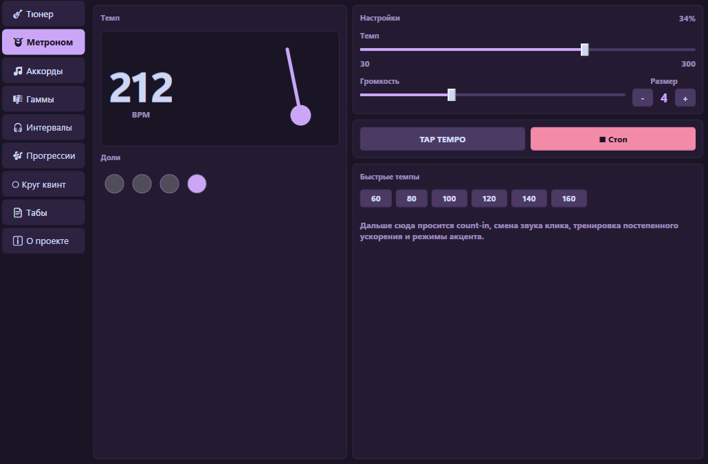
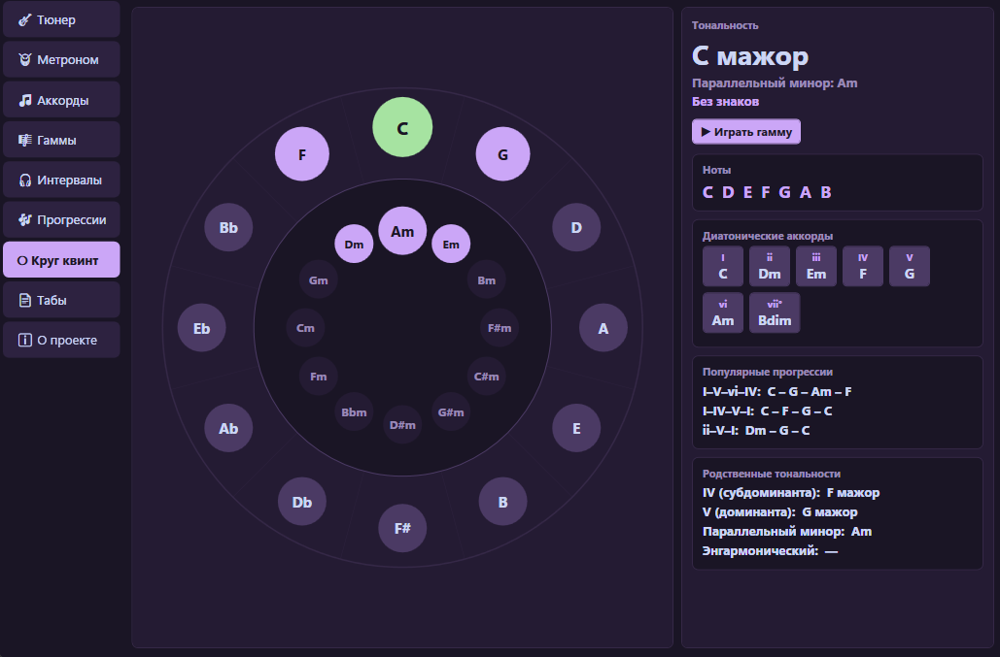
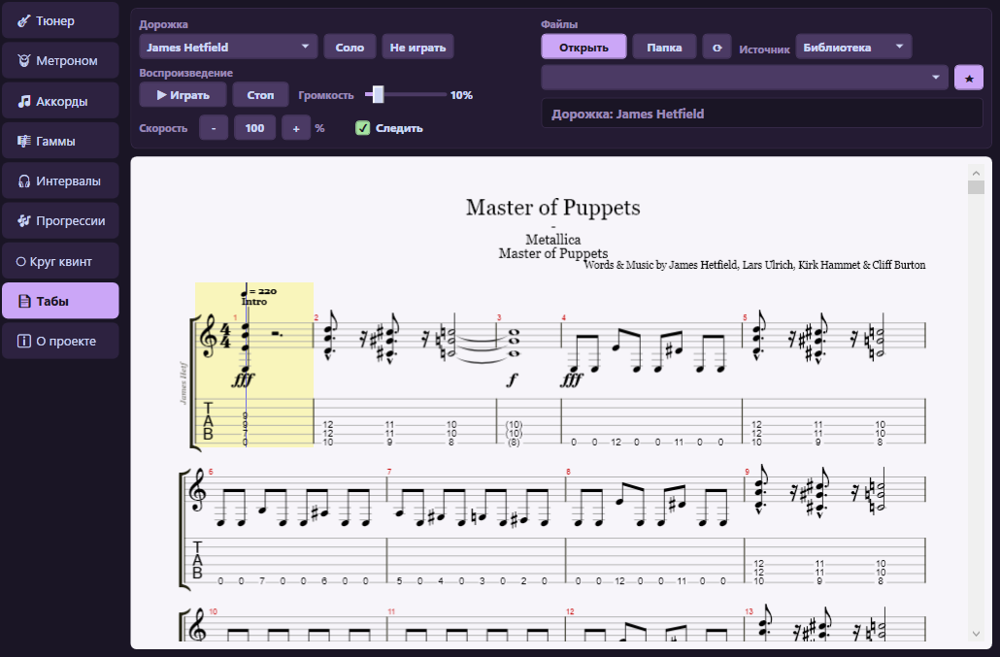

# GuitarToolkit

[](https://github.com/LuTiK1984/GuitarToolkitVST/actions/workflows/ci.yml)


**GuitarToolkit** is a Windows guitar toolkit available as both a standalone WPF desktop application and a VST3 plugin for DAW hosts. It brings together practical practice and writing tools: tuner, metronome, chord library, scale fretboard, interval trainer, progression builder, circle of fifths, and Guitar Pro / MusicXML tab playback.

The project is built with C# and .NET 8. The shared WPF interface is used by both the desktop app and the VST3 plugin, while the audio host layer stays separated between NAudio for desktop and AudioPlugSharp for VST3.

[Русская версия](#guitartoolkit-ru)

## Contents

- [Downloads](#downloads)
- [Screenshots](#screenshots)
- [Features](#features)
- [Architecture](#architecture)
- [Technology Stack](#technology-stack)
- [Requirements](#requirements)
- [Build From Source](#build-from-source)
- [VST3 Deployment](#vst3-deployment)
- [DAW Compatibility](#daw-compatibility)
- [Data and Logs](#data-and-logs)
- [Community and Contributing](#community-and-contributing)
- [Release Notes](#release-notes)
- [License](#license)

## Downloads

The latest release provides two archives:

- `GuitarToolkit_DESKTOP_v.1.5.0.zip` - standalone Windows desktop application.
- `GuitarToolkit_VST3_v.1.5.0.zip` - VST3 plugin package for DAW hosts.

Open the release page:

[GitHub Releases](https://github.com/LuTiK1984/GuitarToolkitVST/releases)

Third-party dependency notes are documented in [THIRD_PARTY_NOTICES.md](THIRD_PARTY_NOTICES.md).

## Screenshots

### Tuner


### Metronome



### Chord Library


### Fretboard and Scales


### Circle of Fifths



### Tabs



## Features

### Tuner

- Real-time guitar input pitch detection.
- FFT, Harmonic Product Spectrum, and parabolic interpolation.
- Detected note, frequency, cents deviation, tuning direction, and input level.
- Local input-device selection in the tuner tab for the desktop app.
- Standard and alternate tunings: Standard, Drop D, Drop C, Open G, Open D, DADGAD, Half Step Down, Full Step Down.
- Adjustable A4 reference from 420 to 460 Hz.
- Input gain control from 0 to 40 dB.

### Metronome

- Tempo range from 30 to 300 BPM.
- 2 to 8 beats per measure.
- First-beat accent.
- Tap tempo.
- Animated pendulum and beat indicators.
- Quick tempo buttons.
- Sample-accurate click generation directly in the audio buffer.
- Spacebar toggles start/stop from any tab.

### Chord Library

- 12 roots and 9 chord types: major, minor, 7, maj7, m7, sus2, sus4, dim, aug.
- Multiple voicings per chord.
- Fretboard chord diagrams with open strings, muted strings, and barre display.
- Chord theory: full type name, formula, and exact notes.
- Difficulty, barre, and favorites filters.
- Favorite chords saved to disk.
- Synthesized chord playback.

### Fretboard and Scales

- Compact guitar fretboard view with string labels, fret numbers, and fret markers.
- Scale highlighting for major, natural minor, pentatonic, blues, modes, harmonic minor, melodic minor, and chromatic scale.
- Note-name and scale-degree display modes.
- Tonic highlighting.
- Ascending scale playback.

### Interval Trainer

- Plays two notes and asks the user to identify the interval.
- 13 intervals from unison to octave.
- Difficulty modes.
- Answer feedback and correct-answer statistics.
- Repeat current question.

### Progression Builder

- Generates diatonic chords for 12 roots and multiple modes/scales.
- Click-to-build chord progressions.
- Built-in preset dropdown.
- Saved custom preset dropdown with explicit save/load/delete actions.
- Tempo-based playback with optional looping.

### Circle of Fifths

- Interactive major/minor circle of fifths.
- Key signature, scale notes, diatonic chords, common progressions, related keys, and enharmonic equivalents.
- Clear highlighting for the selected key and diatonic notes.
- Selected scale playback.

### Tabs

- Guitar Pro and MusicXML viewing through alphaTab.
- Notation and tablature rendering with track selection.
- Play/pause, stop, volume, and flexible speed controls.
- Selected-track solo and mute modes.
- Automatic following of the current playback position.
- Recent files, favorites, and a simple library folder for frequently used tab files.
- Available in both the standalone desktop app and the VST3 plugin.
- Failed alphaTab imports are quarantined from the current library list so one bad file does not keep breaking the tab page.

## Architecture

```text
GuitarToolkit.sln
|-- GuitarToolkit.Core      DSP, theory models, engines, settings
|-- GuitarToolkit.UI        Shared WPF controls used by both app targets
|-- GuitarToolkit.Desktop   Standalone WPF application via NAudio
|-- GuitarToolkit.Plugin    VST3 plugin entry point via AudioPlugSharp
`-- GuitarToolkit.Tests     xUnit tests for Core behavior
```

`GuitarToolkit.Core` is intentionally independent from WPF, NAudio, and AudioPlugSharp. Platform-specific audio input/output lives only in the Desktop and Plugin projects.

## Technology Stack

| Area | Technology |
| --- | --- |
| Language | C# |
| Runtime | .NET 8 |
| UI | WPF |
| Desktop audio | NAudio 2.2.1 |
| Plugin | VST3 via AudioPlugSharp 0.7.9 |
| Tabs | alphaTab / AlphaSkia |
| Tests | xUnit |
| Theme | Catppuccin Mocha-inspired dark UI |

## Requirements

- Windows 10/11 x64.
- .NET 8 runtime or SDK.
- Visual Studio 2022 for development.
- For VST3: a DAW with VST3 support, such as FL Studio, Reaper, Cubase, Ableton Live, or another compatible host.

## Build From Source

Open `GuitarToolkit.sln` in Visual Studio 2022 and select `x64`.

Command line:

```powershell
dotnet build GuitarToolkit.sln --configuration Debug
dotnet test GuitarToolkit.sln --configuration Debug
```

Release package build:

```powershell
powershell -ExecutionPolicy Bypass -File .\build-release.ps1 -Version 1.5.0 -Configuration Release
```

Current verification status:

- Build: 0 errors, 0 warnings.
- Tests: 73/73 passing.

## VST3 Deployment

Use the release ZIP or build the plugin project in `x64`, then run:

```powershell
deploy-vst.bat
```

The script copies the full plugin output folder to:

```text
C:\Program Files\Common Files\VST3\GuitarToolkit\
```

Run the script as Administrator if Windows blocks access to the VST3 folder. Close your DAW before redeploying, then rescan plugins after copying.

Important: copy the whole `GuitarToolkit` plugin folder, not only `GuitarToolkit.PluginBridge.vst3`. The plugin needs its DLL dependencies and the `runtimes` folder, especially for the tab viewer.

For FL Studio: open `Options -> Manage plugins`, make sure the common VST3 folder is scanned, then click `Find installed plugins`.

## DAW Compatibility

DAW-specific setup notes:

- [FL Studio setup](docs/FL_STUDIO.md)
- [Reaper setup](docs/REAPER.md)
- [Supported DAWs](docs/SUPPORTED_DAWS.md)

The repository intentionally includes several NuGet-sourced VST bridge/runtime files used for deployment and DAW loading:

- `GuitarToolkit.PluginBridge.vst3`
- `GuitarToolkit.PluginBridge.runtimeconfig.json`
- `AudioPlugSharpWPF.dll`
- `Ijwhost.dll`

## Data and Logs

User data is stored in:

```text
%AppData%\GuitarToolkit\
```

Files:

- `settings.json` - general settings.
- `favorites.json` - favorite chords.
- `custom_presets.json` - custom progression presets.

Diagnostic logs are written to:

```text
%AppData%\GuitarToolkit\logs
```

## Community and Contributing

- [Contributing guide](CONTRIBUTING.md)
- [Code of conduct](CODE_OF_CONDUCT.md)
- [Security policy](SECURITY.md)
- [Release checklist](RELEASE_CHECKLIST.md)
- [Third-party notices](THIRD_PARTY_NOTICES.md)

Bug reports, feature ideas, and DAW compatibility reports are welcome through
the GitHub issue templates.

## Release Notes

See [CHANGELOG.md](CHANGELOG.md) for release history and [ROADMAP.md](ROADMAP.md) for planned improvements.

## License

GuitarToolkit is released under the [MIT License](LICENSE).

VST is a trademark of Steinberg Media Technologies GmbH.

Third-party dependency notes are listed in [THIRD_PARTY_NOTICES.md](THIRD_PARTY_NOTICES.md).

---

<a id="guitartoolkit-ru"></a>

# GuitarToolkit RU

[English version](#guitartoolkit)

**GuitarToolkit** - набор инструментов для гитариста под Windows. Проект доступен как standalone WPF-приложение и как VST3-плагин для DAW. В одном интерфейсе собраны тюнер, метроном, справочник аккордов, гриф с гаммами, тренажер интервалов, построитель прогрессий, круг квинт и просмотр табулатур Guitar Pro / MusicXML.

Проект написан на C# и .NET 8. Общий WPF-интерфейс используется и desktop-приложением, и VST3-плагином; различается только слой аудио-хоста: NAudio для desktop и AudioPlugSharp для VST3.

## Содержание

- [Загрузка](#загрузка)
- [Скриншоты](#скриншоты)
- [Возможности](#возможности)
- [Архитектура](#архитектура)
- [Стек технологий](#стек-технологий)
- [Требования](#требования)
- [Сборка из исходников](#сборка-из-исходников)
- [Установка VST3](#установка-vst3)
- [Данные и логи](#данные-и-логи)
- [История релизов](#история-релизов)
- [Лицензия](#лицензия)

## Загрузка

В релизе доступны два архива:

- `GuitarToolkit_DESKTOP_v.1.5.0.zip` - standalone-приложение для Windows.
- `GuitarToolkit_VST3_v.1.5.0.zip` - VST3-плагин для DAW.

Страница релизов:

[GitHub Releases](https://github.com/LuTiK1984/GuitarToolkitVST/releases)

Заметки о сторонних библиотеках: [THIRD_PARTY_NOTICES.md](THIRD_PARTY_NOTICES.md).

## Скриншоты

### Тюнер


### Метроном


### Справочник аккордов


### Гриф и гаммы


### Круг квинт


### Табы


## Возможности

### Тюнер

- Определение высоты звука гитары в реальном времени.
- Алгоритм FFT, Harmonic Product Spectrum и параболическая интерполяция.
- Отображение ноты, частоты, отклонения в центах, направления настройки и уровня входного сигнала.
- Выбор устройства ввода прямо на вкладке тюнера в desktop-версии.
- Стандартный и альтернативные строи: Standard, Drop D, Drop C, Open G, Open D, DADGAD, Half Step Down, Full Step Down.
- Настраиваемый эталон A4 от 420 до 460 Гц.
- Усиление входного сигнала от 0 до 40 дБ.

### Метроном

- Темп от 30 до 300 BPM.
- Размер от 2 до 8 долей в такте.
- Акцент первой доли.
- Tap tempo.
- Анимированный маятник и индикаторы долей.
- Быстрые кнопки темпа.
- Sample-accurate генерация клика прямо в аудиобуфере.
- Пробел запускает и останавливает метроном с любой вкладки.

### Справочник аккордов

- 12 тоник и 9 типов аккордов: мажор, минор, 7, maj7, m7, sus2, sus4, dim, aug.
- Несколько аппликатур для каждого аккорда.
- Диаграмма грифа с открытыми струнами, заглушенными струнами и баррэ.
- Теория аккорда: полное название типа, формула и конкретные ноты.
- Фильтры по простым аккордам, баррэ и избранному.
- Избранные аккорды сохраняются на диск.
- Синтезированное воспроизведение аккорда.

### Гриф и гаммы

- Компактный гитарный гриф с подписями струн, номерами ладов и маркерами.
- Подсветка нот выбранной гаммы или лада.
- Поддержка мажора, натурального минора, пентатоник, блюзовой гаммы, ладов, гармонического/мелодического минора и хроматической гаммы.
- Режимы отображения: имена нот или ступени.
- Отдельная подсветка тоники.
- Воспроизведение гаммы восходящей последовательностью.

### Тренажер интервалов

- Воспроизводит две ноты и предлагает определить интервал.
- 13 интервалов от унисона до октавы.
- Режимы сложности.
- Обратная связь по ответу и статистика правильных ответов.
- Повтор текущего вопроса.

### Построитель прогрессий

- Диатонические аккорды для 12 тоник и нескольких ладов/гамм.
- Сборка прогрессии нажатием на ступени.
- Выпадающий список встроенных пресетов.
- Выпадающий список сохраненных пресетов с явными действиями сохранить/загрузить/удалить.
- Воспроизведение прогрессии в заданном темпе с возможностью зацикливания.

### Круг квинт

- Интерактивный мажорно-минорный круг квинт.
- Ключевые знаки, ноты гаммы, диатонические аккорды, популярные прогрессии, родственные тональности и энгармонические варианты.
- Четкая подсветка выбранной тональности и диатонических нот.
- Воспроизведение выбранной гаммы.

### Табы

- Открытие Guitar Pro и MusicXML через alphaTab.
- Отображение нотной записи и табулатуры с выбором дорожки.
- Воспроизведение: играть/пауза, стоп, громкость и гибкая скорость.
- Режимы solo и mute для выбранной дорожки.
- Автоматическое следование за текущей позицией воспроизведения.
- Последние файлы, избранное и простая папка библиотеки для часто используемых табулатур.
- Работает и в standalone-приложении, и в VST3-плагине.
- Файлы, которые падают внутри импортера alphaTab, временно исключаются из текущего списка библиотеки, чтобы один битый файл не ломал вкладку табов.

## Архитектура

```text
GuitarToolkit.sln
|-- GuitarToolkit.Core      DSP, теория, движки, настройки
|-- GuitarToolkit.UI        Общие WPF-компоненты для обоих вариантов приложения
|-- GuitarToolkit.Desktop   Standalone WPF-приложение через NAudio
|-- GuitarToolkit.Plugin    VST3-плагин через AudioPlugSharp
`-- GuitarToolkit.Tests     xUnit-тесты ядра
```

`GuitarToolkit.Core` намеренно не зависит от WPF, NAudio и AudioPlugSharp. Платформенно-зависимый ввод/вывод аудио находится только в проектах Desktop и Plugin.

## Стек технологий

| Область | Технология |
| --- | --- |
| Язык | C# |
| Runtime | .NET 8 |
| UI | WPF |
| Desktop-аудио | NAudio 2.2.1 |
| Плагин | VST3 через AudioPlugSharp 0.7.9 |
| Табы | alphaTab / AlphaSkia |
| Тесты | xUnit |
| Тема | Темная тема в духе Catppuccin Mocha |

## Требования

- Windows 10/11 x64.
- .NET 8 runtime или SDK.
- Visual Studio 2022 для разработки.
- Для VST3: DAW с поддержкой VST3, например FL Studio, Reaper, Cubase, Ableton Live или другой совместимый хост.

## Сборка из исходников

Откройте `GuitarToolkit.sln` в Visual Studio 2022 и выберите платформу `x64`.

Через командную строку:

```powershell
dotnet build GuitarToolkit.sln --configuration Debug
dotnet test GuitarToolkit.sln --configuration Debug
```

Сборка release-пакетов:

```powershell
powershell -ExecutionPolicy Bypass -File .\build-release.ps1 -Version 1.5.0 -Configuration Release
```

Текущее состояние проверки:

- Сборка: 0 ошибок, 0 предупреждений.
- Тесты: 73/73 проходят.

## Установка VST3

Используйте ZIP из релиза или соберите проект плагина в `x64`, затем запустите:

```powershell
deploy-vst.bat
```

Скрипт копирует всю output-папку плагина в:

```text
C:\Program Files\Common Files\VST3\GuitarToolkit\
```

Если Windows запрещает запись в папку VST3, запустите скрипт от имени администратора. Перед повторным деплоем закройте DAW, затем выполните пересканирование плагинов.

Важно: копируйте всю папку `GuitarToolkit`, а не только `GuitarToolkit.PluginBridge.vst3`. Плагину нужны DLL-зависимости и папка `runtimes`, особенно для просмотра табов.

Для FL Studio: откройте `Options -> Manage plugins`, проверьте путь к общей VST3-папке и нажмите `Find installed plugins`.

В репозитории намеренно лежат bridge/runtime-файлы из NuGet, необходимые для загрузки VST3-плагина:

- `GuitarToolkit.PluginBridge.vst3`
- `GuitarToolkit.PluginBridge.runtimeconfig.json`
- `AudioPlugSharpWPF.dll`
- `Ijwhost.dll`

## Данные и логи

Пользовательские данные сохраняются в:

```text
%AppData%\GuitarToolkit\
```

Файлы:

- `settings.json` - основные настройки.
- `favorites.json` - избранные аккорды.
- `custom_presets.json` - пользовательские пресеты прогрессий.

Диагностические логи пишутся в:

```text
%AppData%\GuitarToolkit\logs
```

## История релизов

История изменений: [CHANGELOG.md](CHANGELOG.md).

Планы развития: [ROADMAP.md](ROADMAP.md).

## Лицензия

Личный passion project. VST является товарным знаком Steinberg Media Technologies GmbH.

Заметки о сторонних библиотеках перечислены в [THIRD_PARTY_NOTICES.md](THIRD_PARTY_NOTICES.md).
