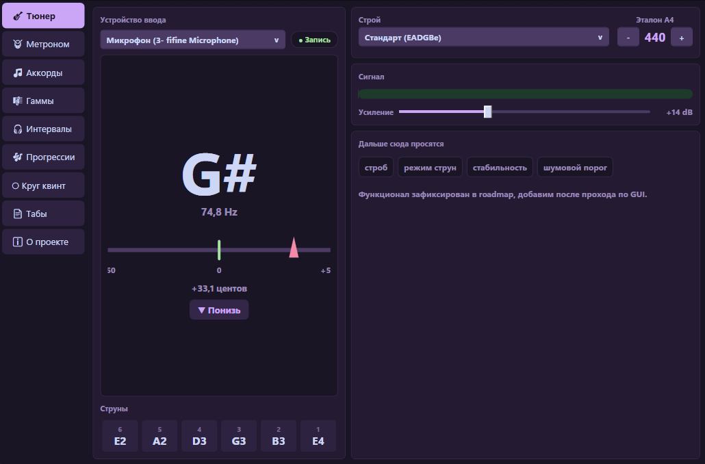
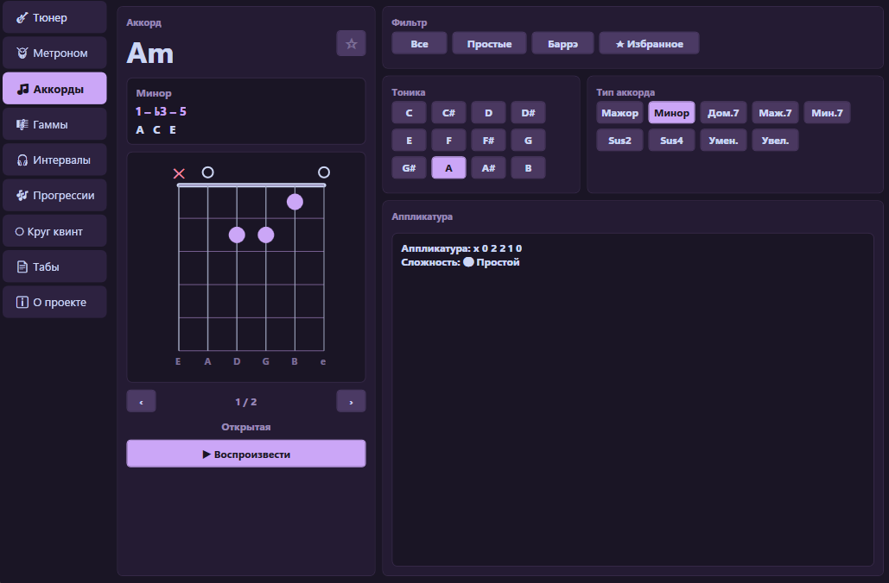
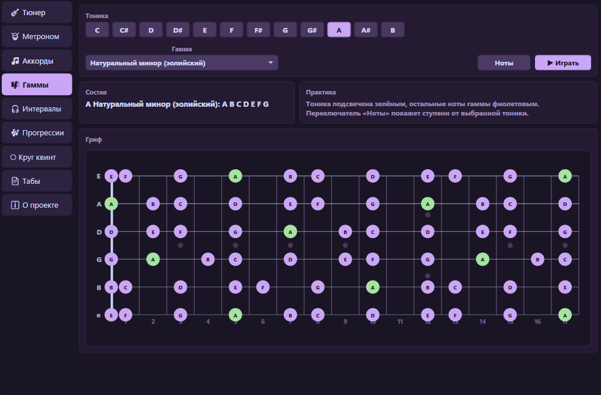

# GuitarToolkit

[](https://github.com/LuTiK1984/GuitarToolkitVST/actions/workflows/ci.yml)


**GuitarToolkit** is a guitar-focused toolkit for Windows: a VST3 plugin for DAW hosts and a standalone WPF desktop application built on C# / .NET 8.

It combines seven practice and theory tools in one interface: tuner, metronome, chord library, fretboard scale visualizer, interval ear trainer, chord progression builder, and circle of fifths.

[Русская версия](#guitartoolkit-ru)

## Table of Contents

- [Downloads](#downloads)
- [Screenshots](#screenshots)
- [Features](#features)
- [Architecture](#architecture)
- [Technology Stack](#technology-stack)
- [Build From Source](#build-from-source)
- [VST3 Deployment](#vst3-deployment)
- [Русская версия](#guitartoolkit-ru)

## Downloads

The latest release provides two separate archives:

- `GuitarToolkit_VST3_v.1.2.0.zip` - VST3 plugin package for DAW hosts.
- `GuitarToolkit_DESKTOP_v.1.2.0.zip` - standalone Windows desktop application.

Open the project releases page:

[GitHub Releases](https://github.com/LuTiK1984/GuitarToolkitVST/releases)

## Screenshots

### Tuner



### Chord Library



### Fretboard & Scales



## Features

### Tuner

- Real-time pitch detection for guitar input.
- FFT + Harmonic Product Spectrum + parabolic interpolation.
- Note name, frequency, cents deviation, input level meter.
- Standard and alternate tunings: Standard, Drop D, Drop C, Open G, Open D, DADGAD, Half Step Down, Full Step Down.
- Adjustable A4 reference from 420 to 460 Hz.
- Input gain control from 0 to 40 dB.

### Metronome

- 30-300 BPM.
- 2-8 beats per measure.
- Accent click on the first beat.
- Tap tempo.
- Sample-accurate click generation directly in the audio buffer.
- Spacebar toggles start/stop from any tab.

### Chord Library

- 12 roots and 9 chord types: major, minor, 7, maj7, m7, sus2, sus4, dim, aug.
- Multiple voicings per chord.
- Fretboard chord diagrams with open strings, muted strings, and barre display.
- Chord theory: full type name, formula, and exact notes.
- Difficulty and favorites filters.
- Favorite chords saved to disk.
- Synthesized chord playback.

### Fretboard & Scales

- 15-fret guitar fretboard with 6 strings.
- Scale highlighting for major, natural minor, pentatonic, blues, modes, harmonic minor, melodic minor, and chromatic scale.
- Note-name or scale-degree display modes.
- Tonic highlighting.
- Ascending scale playback.

### Interval Ear Trainer

- Plays two notes and asks the user to identify the interval.
- 13 intervals from unison to octave.
- Three difficulty levels.
- Correct-answer statistics.
- Repeat current question.

### Progression Builder

- Generates diatonic chords for 12 roots and 11 modes/scales.
- Click-to-build chord progressions.
- 15 built-in presets, including pop, jazz, blues, rock, canon-style, and turnaround patterns.
- Custom preset saving.
- Tempo-based progression playback with optional looping.

### Circle of Fifths

- Interactive major/minor circle of fifths.
- Displays key signatures, scale notes, diatonic chords, common progressions, related keys, and enharmonic equivalents.
- Plays the selected major or minor scale.

## Architecture

```text
GuitarToolkit.sln
├── GuitarToolkit.Core      DSP, theory models, engines, settings
├── GuitarToolkit.UI        Shared WPF controls used by both app targets
├── GuitarToolkit.Plugin    VST3 plugin entry point via AudioPlugSharp
├── GuitarToolkit.Desktop   Standalone WPF app via NAudio
└── GuitarToolkit.Tests     xUnit tests for Core behavior
```

Core is intentionally independent from WPF, NAudio, and AudioPlugSharp. Platform-specific audio input/output is implemented only in the Desktop and Plugin projects.

## Technology Stack

| Area | Technology |
| --- | --- |
| Language | C# |
| Runtime | .NET 8 |
| UI | WPF |
| Plugin | VST3 via AudioPlugSharp 0.7.9 |
| Desktop audio | NAudio 2.2.1 |
| Tests | xUnit |
| Theme | Catppuccin Mocha-inspired dark UI |

## Requirements

- Windows 10/11 x64.
- .NET 8 runtime or SDK.
- Visual Studio 2022 for development.
- For VST3: a DAW with VST3 support, such as FL Studio, Reaper, Cubase, Ableton Live, or another compatible host.

## Build From Source

Open `GuitarToolkit.sln` in Visual Studio 2022 and select `x64`.

Command line:

```powershell
dotnet build GuitarToolkit.sln --configuration Debug
dotnet test GuitarToolkit.sln --configuration Debug
```

Current verification status:

- Build: 0 errors, 0 warnings.
- Tests: 73/73 passing.

## VST3 Deployment

Build the plugin project in `x64`, then run:

```powershell
deploy-vst.bat
```

The script copies the required plugin files to:

```text
C:\Program Files\Common Files\VST3\GuitarToolkit\
```

Run the script as Administrator if Windows blocks access to the VST3 folder. Close your DAW before redeploying, then rescan plugins after copying.

The repository intentionally includes several NuGet-sourced VST bridge/runtime files used for deployment and DAW loading:

- `GuitarToolkit.PluginBridge.vst3`
- `GuitarToolkit.PluginBridge.runtimeconfig.json`
- `AudioPlugSharpWPF.dll`
- `Ijwhost.dll`

## Data Storage

User data is stored in:

```text
%AppData%\GuitarToolkit\
```

Files:

- `settings.json` - general settings.
- `favorites.json` - favorite chords.
- `custom_presets.json` - custom progression presets.

---

<a id="guitartoolkit-ru"></a>

# GuitarToolkit RU

[English version](#guitartoolkit)

**GuitarToolkit** - набор инструментов для гитариста под Windows: VST3-плагин для DAW и самостоятельное WPF-приложение на C# / .NET 8.

В одном интерфейсе собраны семь модулей: тюнер, метроном, справочник аккордов, визуализатор гамм на грифе, тренажер интервалов, построитель аккордовых прогрессий и круг квинт.

## Содержание

- [Загрузка](#загрузка)
- [Скриншоты](#скриншоты)
- [Возможности](#возможности)
- [Архитектура](#архитектура)
- [Стек технологий](#стек-технологий)
- [Сборка](#сборка)
- [Установка VST3](#установка-vst3)
- [Хранение данных](#хранение-данных)

## Загрузка

В релизе доступны два архива:

- `GuitarToolkit_VST3_v.1.2.0.zip` - VST3-плагин для DAW.
- `GuitarToolkit_DESKTOP_v.1.2.0.zip` - standalone-приложение для Windows.

Страница релизов:

[GitHub Releases](https://github.com/LuTiK1984/GuitarToolkitVST/releases)

## Скриншоты

### Тюнер


### Справочник аккордов


### Гриф и гаммы


## Возможности

### Тюнер

- Определение высоты звука в реальном времени.
- Алгоритм FFT + Harmonic Product Spectrum + параболическая интерполяция.
- Отображение ноты, частоты, отклонения в центах и уровня входного сигнала.
- Стандартный и альтернативные строи: Standard, Drop D, Drop C, Open G, Open D, DADGAD, Half Step Down, Full Step Down.
- Настраиваемая опорная частота A4: 420-460 Гц.
- Усиление входного сигнала: 0-40 дБ.

### Метроном

- Темп 30-300 BPM.
- Размер 2-8 долей в такте.
- Акцент первой доли.
- Tap tempo.
- Sample-accurate генерация щелчков прямо в аудиобуфере.
- Пробел запускает и останавливает метроном с любой вкладки.

### Справочник аккордов

- 12 тоник и 9 типов аккордов: мажор, минор, 7, maj7, m7, sus2, sus4, dim, aug.
- Несколько аппликатур для каждого аккорда.
- Диаграмма грифа с открытыми, заглушенными струнами и баррэ.
- Теория аккорда: название типа, формула и конкретные ноты.
- Фильтры по сложности и избранному.
- Избранные аккорды сохраняются на диск.
- Синтезированное воспроизведение аккорда.

### Гриф и гаммы

- Гриф на 15 ладов и 6 струн.
- Подсветка нот выбранной гаммы или лада.
- Поддержка мажора, минора, пентатоник, блюзовой гаммы, ладов, гармонического/мелодического минора и хроматической гаммы.
- Режимы отображения: имена нот или ступени.
- Отдельная подсветка тоники.
- Воспроизведение гаммы восходящей последовательностью.

### Тренажер интервалов

- Воспроизводит две ноты и предлагает определить интервал.
- 13 интервалов от унисона до октавы.
- Три уровня сложности.
- Статистика правильных ответов.
- Повтор текущего вопроса.

### Построитель прогрессий

- Диатонические аккорды для 12 тоник и 11 ладов/гамм.
- Сборка прогрессии нажатием на ступени.
- 15 встроенных пресетов.
- Сохранение пользовательских пресетов.
- Воспроизведение прогрессии в заданном темпе с возможностью зацикливания.

### Круг квинт

- Интерактивный кварто-квинтовый круг.
- Мажорные и параллельные минорные тональности.
- Ключевые знаки, ноты гаммы, диатонические аккорды, популярные прогрессии и родственные тональности.
- Воспроизведение выбранной мажорной или минорной гаммы.

## Архитектура

```text
GuitarToolkit.sln
├── GuitarToolkit.Core      DSP, теория, движки, настройки
├── GuitarToolkit.UI        Общие WPF-компоненты
├── GuitarToolkit.Plugin    VST3-плагин через AudioPlugSharp
├── GuitarToolkit.Desktop   Standalone WPF-приложение через NAudio
└── GuitarToolkit.Tests     xUnit-тесты ядра
```

`GuitarToolkit.Core` не зависит от WPF, NAudio и AudioPlugSharp. Различия между desktop-версией и VST3-плагином находятся только в платформенных проектах.

## Стек технологий

| Область | Технология |
| --- | --- |
| Язык | C# |
| Runtime | .NET 8 |
| UI | WPF |
| Плагин | VST3 через AudioPlugSharp 0.7.9 |
| Desktop-аудио | NAudio 2.2.1 |
| Тесты | xUnit |
| Тема | Темная тема в стиле Catppuccin Mocha |

## Требования

- Windows 10/11 x64.
- .NET 8 runtime или SDK.
- Visual Studio 2022 для разработки.
- Для VST3: DAW с поддержкой VST3, например FL Studio, Reaper, Cubase, Ableton Live или другой совместимый хост.

## Сборка

Откройте `GuitarToolkit.sln` в Visual Studio 2022 и выберите платформу `x64`.

Через командную строку:

```powershell
dotnet build GuitarToolkit.sln --configuration Debug
dotnet test GuitarToolkit.sln --configuration Debug
```

Текущее состояние:

- Сборка: 0 ошибок, 0 предупреждений.
- Тесты: 73/73 проходят.

## Установка VST3

Соберите проект плагина в `x64`, затем запустите:

```powershell
deploy-vst.bat
```

Скрипт копирует файлы в:

```text
C:\Program Files\Common Files\VST3\GuitarToolkit\
```

Если Windows запрещает запись в папку VST3, запустите скрипт от имени администратора. Перед повторным деплоем закройте DAW, затем выполните пересканирование плагинов.

В репозитории намеренно лежат bridge/runtime-файлы из NuGet, необходимые для загрузки VST3-плагина:

- `GuitarToolkit.PluginBridge.vst3`
- `GuitarToolkit.PluginBridge.runtimeconfig.json`
- `AudioPlugSharpWPF.dll`
- `Ijwhost.dll`

## Хранение данных

Пользовательские данные сохраняются в:

```text
%AppData%\GuitarToolkit\
```

Файлы:

- `settings.json` - основные настройки.
- `favorites.json` - избранные аккорды.
- `custom_presets.json` - пользовательские пресеты прогрессий.

## License

Educational project. VST is a trademark of Steinberg Media Technologies GmbH.
